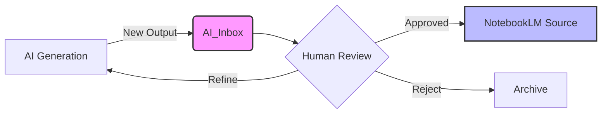

# AI Content Dashboard

## Overview
This dashboard tracks the status of AI-generated inputs as they flow into our grounded knowledge base.

## Process Flow

## Content Timeline

| Date | Item Name | Type | Status | Reviewer Notes |
| :--- | :--- | :--- | :--- | :--- |
| 2026-02-04 | Ownership Structures Brief | Brief | `Unreviewed - Pending Move` | Currently in .agent/docs |
| 2026-02-04 | NotebookLM Agent Context | Brief | `Unreviewed` | |
| | | | | |

## Inbox Location
> [!TIP]
> Place new raw outputs in: [AI_Inbox](file:///c:/Users/benja/OneDrive/Documents/Google%20Antigravity/VerseRidge%20Corporate/AI_Inbox)

## Legend
- **Unreviewed**: Freshly generated, raw output.
- **Reviewing**: Currently being read/verified by a human.
- **Grounded**: Approved and uploaded to NotebookLM as a source.
- **Archived**: Rejected or outdated.
